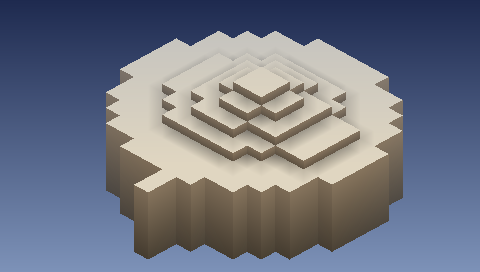

# ARGUS — игра для Sony PSP

Изометрическая головоломка-приключение про Аргуса, стоглазого стража. Homebrew на C + PSPSDK,
вся графика процедурная, дизайн — минимализм в духе Monument Valley. Документы: `docs/GDD.md`
(концепция), `docs/TECH.md` (техплан), `CLAUDE.md` (правила для Claude Code).



## Быстрый старт

```
bash ci/session-start.sh          # тулчейн pspdev в ~/pspdev + Python-зависимости (в веб-сессии — автоматически)
make test                         # юнит-тесты core/ на хосте
make psp                          # build/ARGUS/EBOOT.PBP + data/
bash ci/build-ppsspp.sh           # один раз: PPSSPPHeadless в ~/ppsspp (10–20 минут)
make run-emu                      # прогон smoke-скрипта в эмуляторе, PNG в build/shots/
```

## На приставку

Нужна кастомная прошивка (актуальная — ARK-5; подойдут и ARK-4, PRO, ME). Скопировать папку `build/ARGUS` (или артефакт
`ARGUS` из GitHub Actions) в `ms0:/PSP/GAME/ARGUS/` на карте памяти и запустить из меню «Игра».
Тот же EBOOT.PBP без изменений работает в PPSSPP на ПК и телефоне.

Управление (этап 0): L/R — поворот камеры, Start — выход. Файл `autoplay.txt` рядом с EBOOT
воспроизводит скриптованный ввод и делает скриншоты в `shots/` (см. `tests/autoplay/`).
